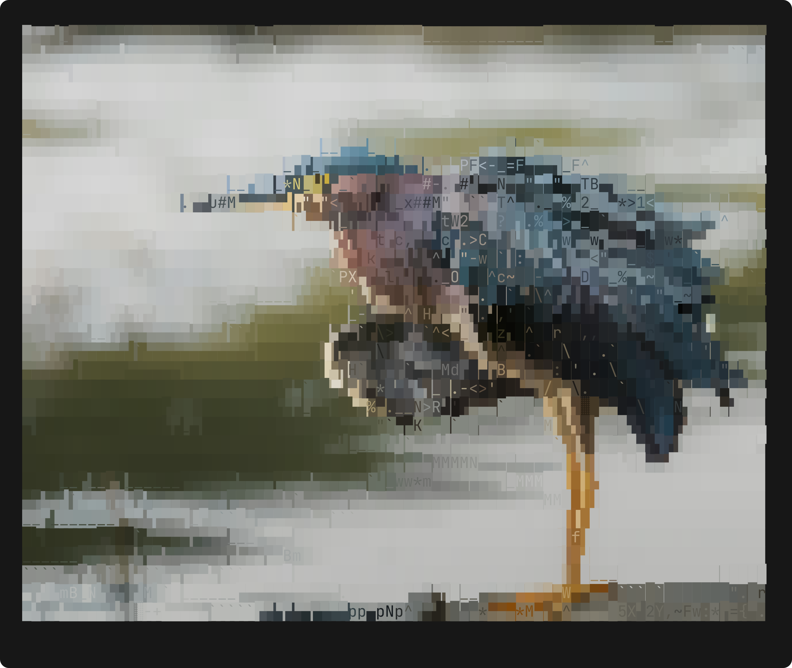
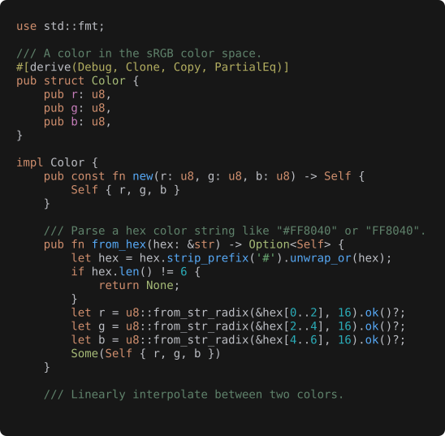
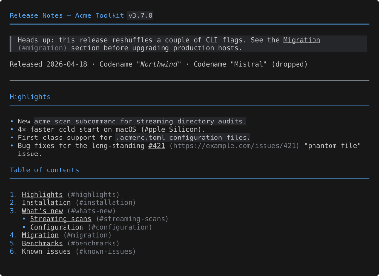
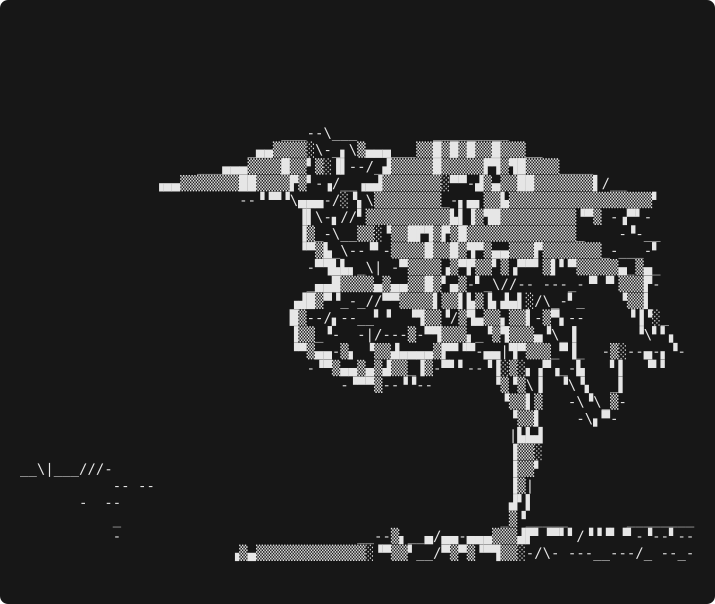

# peek

```
                 __  
   ___  ___ ___ / /__
  / _ \/ -_) -_)  '_/
 / .__/\__/\__/_/\_\ 
/_/ a file previewer
```

Modern terminal file viewer — preview any file, any format.

<p align="center">
  <br>
  <sub>Glyph-matched 24-bit image rendering — a real photo, drawn with characters.</sub>
</p>

<p align="center">
  
  
  
</p>

- **Syntax highlighting** for 100+ languages via syntect
- **Pretty-printing** for JSON / YAML / TOML / XML
- **Aligned tables** for CSV / TSV with sticky header, type inference, streaming record reader
- **SQLite databases** — read-only schema listing + streaming row viewer with sliding-window cursor
- **Spreadsheets** — `.xlsx` / `.xlsm` / `.ods`: sheet listing → aligned table per sheet, CSV
  extract, workbook metadata
- **Presentations** — `.pptx` / `.pptm` / `.ppsx` / `.odp`: slide-by-slide text (`n` / `p` to
  step, per-slide search); Apple Keynote (`.key`) shows the embedded preview + metadata
- **ASCII-art image rendering** with glyph-matched 24-bit color. Animated gifs!
- **Documents** — Markdown, Jupyter notebooks (`.ipynb`), PDF, Adobe Illustrator (`.ai`), DOCX, ODT,
  RTF, EPUB, CBZ. PDF pages render as images with an optional reconstructed-text overlay (`o`)
  that writes the real text over the pixels at matching zoom
- **Email** — `.eml` messages and `.mbox` mailboxes: rendered headers + body, attachment listing +
  extract, message-list drill-in
- **Calendar / contacts** — iCalendar (`.ics`) and vCard (`.vcf`): rendered agenda / contact cards
  with human date-times, grouped fields, recurrence
- **Vector / PostScript** — EPS / PostScript (`.eps`, `.ps`): embedded preview, optional Ghostscript
  render, DSC metadata
- **Containers** — ZIP / tar / 7z / cpio / ar archives, ISO disk images, audio metadata
- **Executables** — ELF / Mach-O / PE / WebAssembly (`.wasm`) object files: header, sections,
  symbols
- **Java classfiles** — `.class` header, fields, methods with decoded signatures
- **Certificates and keys** — PEM / DER X.509 / CSR / CRL / keys / OpenSSH pubkeys / JWK: subject,
  validity, SANs, fingerprints, thumbprints
- **Fonts** — TrueType / OpenType / TTC collections / WOFF / WOFF2: rasterised specimen render +
  family / weight / glyphs / script coverage
- **`.DS_Store`** — Apple Finder's per-folder store decoded to a records table: icon positions,
  window geometry, view style, background, modification dates
- **Hex dump** fallback for binary, reachable from any view with `x`
- **Interactive viewer** with live theme cycling, info screen, extraction, text search (literal or
  regex), soft wrap, image zoom/pan

peek is a single-file viewer: one path (or stdin) at a time. Run peek once per file.

## Install

macOS / Linux:

```sh
curl -fsSL https://raw.githubusercontent.com/thaapasa/peek/main/install.sh | sh
```

Installs the latest release into `~/.local/bin`. Supports `aarch64` and `x86_64`. Pin a version
with `PEEK_VERSION=v0.1.0` or relocate with `PEEK_INSTALL_DIR=/usr/local/bin`.

Manual downloads, Windows, building from source, and updating: see the
[Installation chapter](https://thaapasa.github.io/peek/installation.html) of the manual.

## Usage

Point peek at a file and it picks the view — source highlight, image render, structured
pretty-print, paged document, container listing:

```sh
peek src/main.rs                    # source code, syntax highlighted
peek photo.jpg                      # image rendered as glyph-matched art
peek config.json                    # structured data, pretty-printed
peek book.epub                      # paged read with TOC + metadata
peek server.pem                     # certificate — subject, validity, SANs, fingerprints
```

But the file types are only half the tool. The same binary does **operations** on those files:

```sh
# Inspect metadata — human-readable, or JSON for pipelines
peek server.pem --info              # subject, issuer, validity, key type, SANs
peek photo.jpg --info --json | jq .image.width

# Render an image as Sobel edge line-art (other modes: full / block / geo / ascii)
peek diagram.png -m contour
peek photo.jpg -m contour --edge-density 0.1   # denser edges

# List a container's entries — the keys you feed back to --extract
peek archive.tar.gz --list
peek book.epub --list

# Extract a sub-item out of a container, optionally renaming it
peek archive.tar.gz -x src/main.rs -o main.rs   # pull one entry, rename on the way out
peek archive.tar.gz -x logo.png -o -            # raw bytes straight to stdout

# Force print mode (no interactive viewer) — pipe-friendly
peek config.json -p | grep version
echo '{"a":1}' | peek               # stdin auto-detected
```

peek also reads executables, Java classfiles, fonts, calendars, vCards, `.DS_Store`, and more —
see the manual for the full list.

Run `peek -h` for the short option list, `peek --help` for the full set, or read the
[manual](https://thaapasa.github.io/peek/) for per-format details, keyboard shortcuts,
extraction, themes, and the full CLI reference.

## Manual

Full user manual: **<https://thaapasa.github.io/peek/>**.

Sources in [`manual/`](manual/) — built with [mdbook](https://rust-lang.github.io/mdBook/).
Local preview:

```sh
cargo install mdbook
mdbook serve manual    # opens http://localhost:3000
```

## Credits

Demo photo
by [Dmytro Koplyk on Unsplash](https://unsplash.com/photos/a-green-heron-stands-on-one-leg-by-the-water-LHZgiiQz97o).
Full attribution for all bundled sample files: [CREDITS.md](CREDITS.md).

Screenshots regenerate from repo fixtures with `just demos` (see `just setup` for the tooling).

## License

MIT
