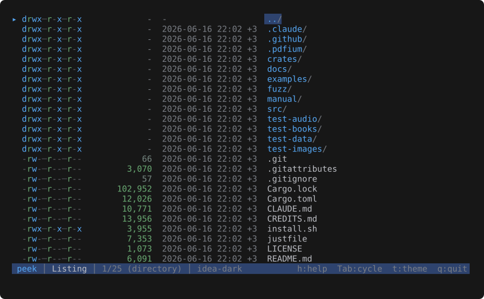

# Directories

`peek <dir>` opens a one-level listing instead of erroring on "is a directory". Columns mirror
the archive TOC view: permissions, size, mtime, name.

*Browsing the project root: directories first (trailing `/`), then files, with a synthetic `..`
row to walk back up. `Enter` descends into the selected entry.*

Sorted dirs-first, then by case-insensitive name. A synthetic `..` row leads the list
(suppressed at filesystem root) so the user can walk back up — selecting `..` canonicalizes
the current path and re-targets to its parent. Walking back up lands the cursor on the
subdirectory you came from rather than the top of the list, so stepping in and out of sibling
directories stays put where you were.

| Key         | Action                                                                       |
|-------------|------------------------------------------------------------------------------|
| `Enter`     | Descend (file → push frame; directory → re-target current frame)             |
| `Backspace` | Up to the parent directory (cursor lands on the directory you came from)     |
| `Esc`       | At a directory listing, exits peek                                           |

Hidden entries are included. Symlinks are followed for kind classification; broken symlinks
still show as `l`, and other special files (sockets, FIFOs, devices) show as `?`.

`--print` and `--list` both render the listing.
