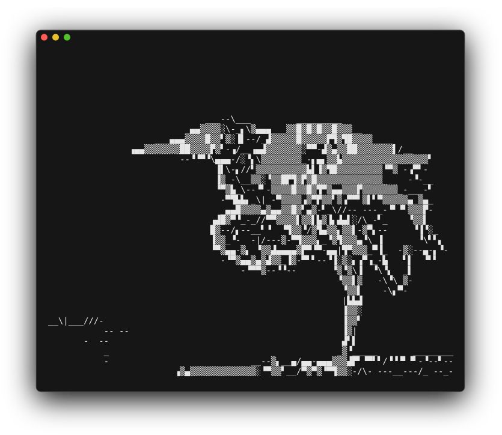

# Images

Raster images render as ASCII art with 24-bit color, using glyph-matched character selection.

*The default `full` mode: every terminal cell picks the glyph and foreground/background colors
that best match the pixels beneath it.*

| Format  | Extensions             |
|---------|------------------------|
| PNG     | `.png`                 |
| JPEG    | `.jpg`, `.jpeg`        |
| GIF     | `.gif`                 |
| BMP     | `.bmp`                 |
| WebP    | `.webp`                |
| TIFF    | `.tiff`, `.tif`        |
| ICO     | `.ico`                 |
| AVIF    | `.avif`                |
| PNM     | `.pnm`, `.pbm`, `.pgm` |
| TGA     | `.tga`                 |
| OpenEXR | `.exr`                 |
| QOI     | `.qoi`                 |
| DDS     | `.dds`                 |

Decoded via the [image](https://crates.io/crates/image) crate.

## Render modes

Cycle with `m` (or `--image-mode <mode>`):

| Mode      | Description                                                         |
|-----------|---------------------------------------------------------------------|
| `full`    | All glyphs (block, quadrant, extended) — default                    |
| `block`   | Block / quadrant elements + ASCII subset                            |
| `geo`     | Block / quadrant elements + line segments only                      |
| `ascii`   | Legacy luminance-based density ramp (for terminals without blocks)  |
| `contour` | Sobel edge detection rendered as line-art                           |

`--edge-density` tunes the `contour` line count.

*The same photo in `contour` mode — Sobel edge detection drawn as line-art instead of filled
color.*

## Backgrounds

Images with transparency need a compositing background before ASCII rendering. Without one,
transparent regions default to black, making dark content invisible on dark terminals.

Cycle with `b` (or `--background <mode>`):

| Background     | Description                                       |
|----------------|---------------------------------------------------|
| `auto`         | Pick black/white based on image content (default) |
| `black`        | Solid black                                       |
| `white`        | Solid white                                       |
| `checkerboard` | 8×8 gray Photoshop-style pattern                  |

## Fit modes

Cycle with `f`:

| Mode        | Behavior                                                              |
|-------------|-----------------------------------------------------------------------|
| `Contain`   | Fit within both axes — whole image shown (default)                    |
| `FitWidth`  | Width fills the terminal; height grows freely → vertical scroll       |
| `FitHeight` | Height fills the terminal; width grows freely → horizontal scroll     |

Pipe / `--print` output always uses `Contain`. The regular
[scroll keys](../keyboard-shortcuts.md#navigation) move the overflowing axis: vertical under
FitWidth, horizontal under FitHeight; top / bottom jumps go to top-left / bottom-right.

## Zoom

See [Zoom & pan](../viewer/zoom-pan.md) for keys and behaviour.

## Animated GIF / WebP

Auto-plays at native frame rate. `Space` toggles play/pause, `n` / `p` step frames, `e`
extracts the current frame as a PNG. Print mode renders the first frame. Frame stats appear in
the file info screen.

## Info view

Dimensions, megapixels, color mode, bit depth, ICC profile, HDR detection (Ultra HDR gain map
markers), animation stats, EXIF, XMP metadata.

EXIF fields surfaced: camera make/model, lens, orientation, resolution/DPI, exposure, aperture,
ISO, focal length, flash, white balance, date taken, GPS, artist, copyright. XMP scraped from
head bytes for Dublin Core / XMP fields (title, subject, description, creator, rights, rating,
label).
