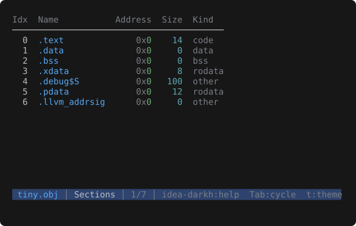
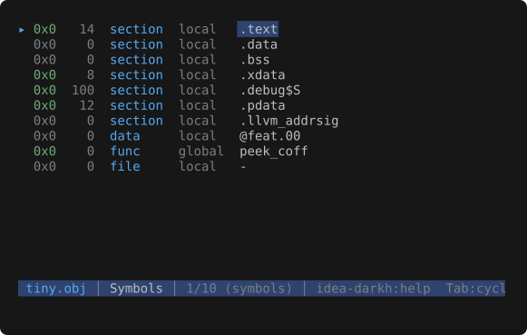

# Object files

Executables, shared libraries, relocatable objects, and **WebAssembly** modules — **ELF**,
**Mach-O**, **PE / COFF**, and **`.wasm`** — open in a dedicated viewer rather than the binary hex
fallback. Detection is by magic bytes, so an extensionless binary like `/bin/ls` is recognised
without a `.elf` / `.exe` extension. WebAssembly functions surface in the Symbols view.

## Views

Tab cycles three views:

- **Info** — the header summary: format, architecture, kind (executable, relocatable object,
  dynamic library, core dump), 32- or 64-bit, endianness, entry point, section and symbol counts,
  whether debug info is present, the build identity (ELF build ID, Mach-O UUID, or PE PDB GUID),
  and the shared libraries the file links against (ELF `DT_NEEDED`, Mach-O dylibs, PE imports —
  shown only when the file has any).
- **Sections** — a table of every section: index, name, address, size, kind.
- **Symbols** — a listing of every symbol: address, size, type, bind, name. `Enter` jumps the
  **Hex** view straight to the selected symbol's byte offset, so you can go from a name to its
  bytes in one keystroke (the landed byte is highlighted). Symbols with no on-disk location —
  undefined imports, or `.bss` data — list with a muted address and don't jump. When the file is
  stripped, the dynamic symbol table is shown in place of the missing `.symtab`.

## Navigating sections and symbols

- The **Sections** table keeps its column header pinned at the top while the body scrolls; column
  widths fit their content.
- `Left` / `Right` pan both views — symbol names are often wider than the terminal.
- `/` searches names; `n` / `p` step through matches, scrolling or panning only as far as needed to
  bring each hit on screen.
- `t` cycles the theme; both views recolour in place.

## Universal (fat) Mach-O

A universal Mach-O carries several architecture slices in one file. peek parses the slice matching
your machine and lists every slice in the Info view.

Bare COFF `.obj` files (no dedicated magic) are recognised by validating the COFF header, so a
Wavefront `.obj` 3D model — which shares the extension but is text — still opens as text.

## Limitations

Sections and symbols are views, not extractable files — there is no `e` extract here, and the
symbol row's `Enter` jumps within the file rather than opening anything. `peek --list` on an object
file prints the symbol table (address, size, type, bind, name) as a readable `nm`-style dump — handy
on stdout, but there are no extract keys to pipe into `--extract`.
