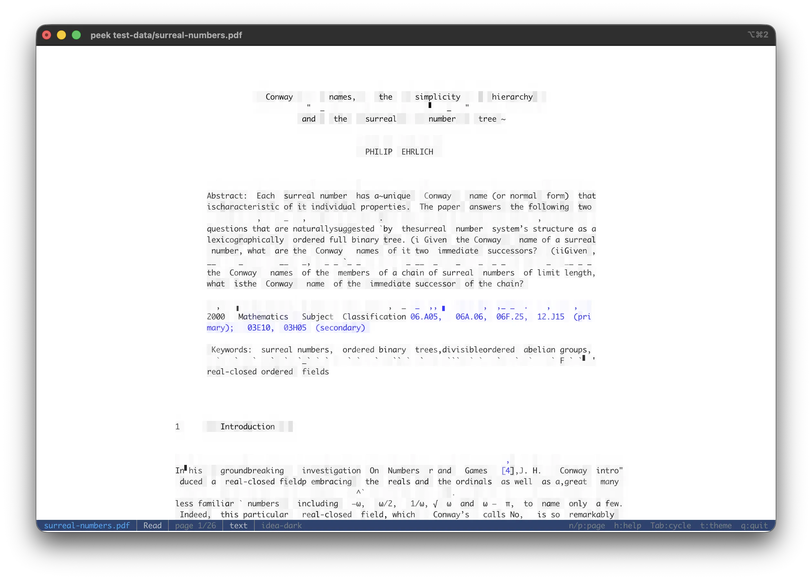

# PDF & Adobe Illustrator

`.pdf` files use [Pdfium](https://pdfium.googlesource.com/pdfium/) (Google's PDF library,
dynamically loaded from `libpdfium.*` shipped alongside peek — no system install needed).

`.ai` files (Adobe Illustrator, 2005 onwards) are PDF documents internally, so they open
through the same modes — the Info section just labels them "Adobe Illustrator". Older
PostScript-only Illustrator files are not supported. A few `.ai` files keep their artwork
only in Illustrator-private data behind a blank visible PDF page; those render empty (Preview
and QuickLook show them blank too).

## Modes

Cycled with Tab:

- **Read** (default) — paged image render. Each page is rasterized via Pdfium and ASCII-rendered
  through the shared image pipeline. `n` / `p` step pages; the status line shows `page X/Y`.
  Zoom / pan via the standard keys ([Zoom & pan](../viewer/zoom-pan.md)). Per-page cache keyed
  by terminal size + render settings; resize or mode cycling re-renders only the visible page.

  `o` toggles the **reconstructed-text overlay**: real words from the PDF's text layer are
  written over the rendered glyph cells at their page positions, so zooming to roughly one
  text line per terminal row turns the pixel mush into readable sentences (around 2× zoom for
  a typical A4 page at full terminal width). Each word is centered in its rendered box and
  cropped to fit; when zoomed far past 1:1 the word floats inside its (now huge) rendered
  letters instead of blanking them. Words rendered much smaller than a terminal cell are left
  alone — zoom in until lines stop colliding. The status line shows `text` while the overlay
  is active. Only offered when the document has a text layer.

  

  *The Read view with the reconstructed-text overlay (`o`): rasterized page cells underneath,
  the PDF's own words written over them at their page positions.*
- **Text** — width-wrapped text extraction across the whole document, separated by muted
  `--- Page N ---` markers. Present only when the document has a text layer; image-only scans
  and outlined-vector artwork (`.ai`) have none, so the tab is omitted rather than shown empty.
- **Embeds** — listing of every extractable inner item. Covers `/EmbeddedFiles` attachments
  (`attachments/<name>`) and per-page inline image XObjects (`pages/page{N}/image{M}.{ext}`).
  `Enter` / `e` extracts the selected entry as a memory-backed source that re-enters peek (an
  attached CSV opens in a CSV view, an inline image renders as ASCII art, …). Hidden when the
  PDF has neither attachments nor inline images.
- **Info** — PDF version, title, author, subject, keywords, description, creation / modification
  dates, page count, attachment count, inline-image count, and an encrypted flag when set.

Print mode (`--print`) walks every page in order separated by blank lines. `cat file.pdf | peek`
detects the `%PDF-` magic and routes through the PDF mode stack.

Encrypted / password-protected PDFs surface the open error in the Info section instead of
crashing.
