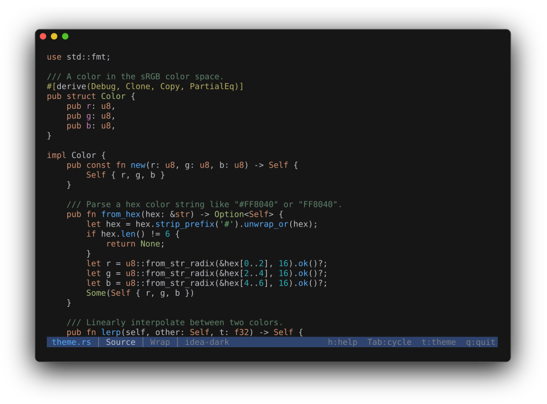

# Source code

Source files render as syntax-highlighted text via [syntect](https://github.com/trishume/syntect)
with [two-face](https://github.com/Enselic/two-face) / bat extended grammars — 100+ languages
including Rust, Python, JavaScript, TypeScript, C, C++, Java, Go, Ruby, Shell, TOML, Dockerfile.



*Highlighting applies automatically when you open a recognized source file; the theme follows the
active [color theme](../viewer/themes.md).*

If detection misses, force a language with `-L`:

```sh
cat script | peek -L bash
peek -L rust unknown_file
```

## Config files

Config files highlight through the same path — `.ini`, `.cfg`, `.conf`, `.properties`, `.env`,
`.hcl`, `.tf`, and by-name matches like `Makefile`, `Dockerfile`, `.gitignore`, and
`.editorconfig`. A few filename special cases cover gaps where the extension misleads or is
absent: `.env.local` / `.env.production` / `.envrc` highlight as `.env`, `justfile` uses the
Makefile grammar, and `.dockerignore` uses the gitignore grammar. Formats with no grammar
(`.dhall`, `.cue`) show as plain text.

## Line numbers

Off by default. Enable at startup with `-n` / `--line-numbers`, or toggle with `l` in the viewer.

## Soft wrap

On by default. Toggle with `w`. When off, `Left` / `Right` pan the viewport horizontally
(`less -S` feel).

## SQL

`.sql` / `.ddl` / `.dml` / `.psql` / `.pgsql` files render as highlighted source. The Info view
adds an SQL section: dialect guess (PostgreSQL / MySQL / SQLite / T-SQL / generic), statement
count broken down by category (DDL / DML / DQL / TCL / Other), inventories of created objects (tables,
views, indexes, functions, triggers), comment-line count, and a flag when an inline `$$ … $$`
PL/pgSQL block is present.

## CSS

`.css` files render as highlighted source. The Info view adds a CSS section: style-rule count
(CSS nesting included), selector count with a per-kind histogram (class / id / element / pseudo /
attribute / universal), custom-property count, `@media` and `@keyframes` counts, and an `@import`
list — external URLs flagged. A Colors section shows the stylesheet's colour palette as block
swatches, most-frequent first. Colour words inside selectors, strings, or comments are not
mistaken for colours.
