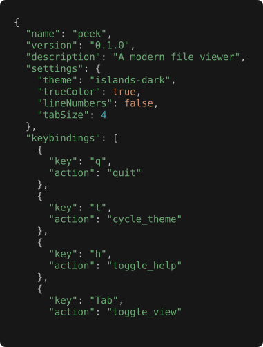

# Structured data

| Format     | Extensions          |
|------------|---------------------|
| JSON       | `.json`, `.geojson` |
| JSONC      | `.jsonc`            |
| JSON5      | `.json5`            |
| JSON Lines | `.jsonl`, `.ndjson` |
| YAML       | `.yaml`, `.yml`     |
| TOML       | `.toml`             |
| XML        | `.xml`              |

## Pretty vs raw

Two sub-modes, toggled with `r` (or `--raw` on the CLI):

- **Pretty** (default for JSON / JSONL / YAML / TOML / XML) — reformatted, with syntax
  highlighting.
- **Raw** — verbatim source, still highlighted unless `--plain` / `-P` is set.

*Keys, strings, numbers, and booleans each colored — comments preserved, source formatting
intact (JSONC defaults to raw rather than pretty).*

JSONC and JSON5 default to **raw** because the pretty path collapses comments and JSON5 syntax;
press `r` to opt into strict-JSON pretty when needed.

JSON Lines pretty: each non-empty line round-trips through `serde_json` separated by a blank
line.

## Info view

Top-level kind, key/element count, max nesting depth, total node count. For XML, the root
element name and declared namespaces.
