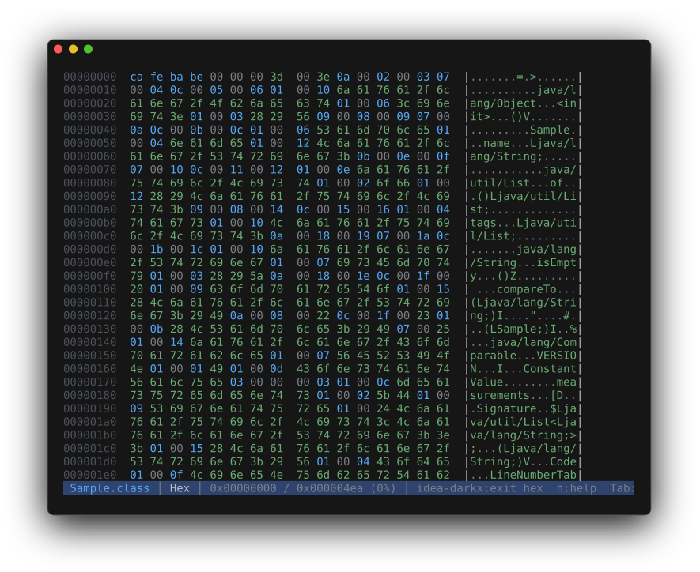

# Hex dump

Press `x` from any view to drop to a raw hex dump — useful for inspecting bytes regardless of
file type. Press `x` again to return to the previous primary mode. When hex is the default for a
binary file, no primary mode exists, so `x` is a no-op there.

`hexdump -C` style: 8-digit offset, two hex columns of N/2 bytes separated by an extra space,
then a printable-ASCII column between `|`s. Bytes-per-row scales with terminal width:
`14 + 4*bpr` columns, rounded down to a multiple of 8, minimum 8. Pipe mode honors `$COLUMNS`
(≥ 24) or falls back to 16.

Reads from disk on demand — no full-file slurp, no problem with multi-GB inputs.

The viewer tracks a logical `Position` (byte offset or line index) on switch-out and restores it
on switch-in. Entering hex from a text view positions the top at the byte offset corresponding to
the current line; returning to text re-aligns the line scroll.
