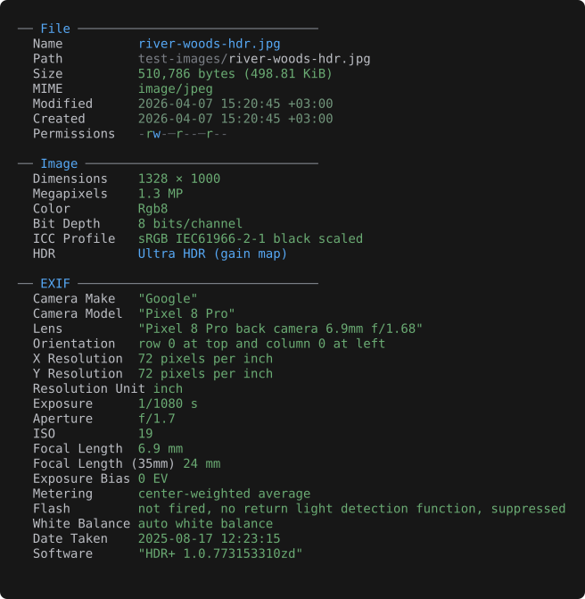

# File info

Every file type has an Info view, reachable via:

- **`i`** in the viewer — jump straight there
- **`Tab`** — cycle into Info as one of the file's view modes
- **`--info`** on the CLI — print info and exit



*The Info view groups universal fields (name, size, MIME, timestamps) with format-specific
sections — here the image's dimensions, color model, HDR gain map, and the camera / lens /
exposure metadata read straight from EXIF.*

## Universal fields

- **File** — name, path, size (exact + human-readable)
- **MIME** — detected via magic bytes
- **Permissions** — per-character coloring
- **Timestamps** — created / modified / accessed, age-based coloring

## Format-specific sections

| File kind        | Info section adds                                                                                  |
|------------------|----------------------------------------------------------------------------------------------------|
| Text / source    | Line / word / char counts, blank lines, longest line, line endings, indent style, encoding, shebang |
| Markdown         | Heading counts, fenced code + langs, links, images, tables, list items, task progress, reading time |
| SQL              | Dialect, statement counts by category, created-object inventory, comment count, PL/pgSQL flag       |
| CSS              | Rule count, selector count + per-kind histogram, `@media` / `@keyframes` / custom-property counts, `@import` list, colour swatch grid |
| Structured data  | Top-level kind, key/element count, max nesting depth, total node count                              |
| CSV / TSV        | Format, delimiter, encoding, header detection, per-column type inference, record count, malformed-row counter |
| Spreadsheet      | Sheet count + names, title, author, subject, keywords, created / modified                           |
| SQLite           | Page size, page count, encoding, journal mode, schema / user version, table / view / index / trigger counts, total rows, largest tables |
| XML / SVG        | Root element, namespaces, element counts                                                            |
| Notebook         | Format, kernel, language, cell counts (code / markdown / raw), output / image / error counts, max execution count |
| Image            | Dimensions, megapixels, color mode, bit depth, ICC profile, HDR, EXIF, XMP                          |
| Animation        | Frame count, total duration, average FPS, loop count                                                |
| Audio            | Container, codec, channels, sample rate, bit depth, bitrate, duration; tag fields                   |
| Document         | Title, author, subject, keywords, dates, paragraph / word / image counts |
| Email            | Message count, From, To, Cc, Subject, Date, Message-ID, attachment count |
| Calendar / contacts | iCalendar: name, event / todo counts, date range, version, product. vCard: contact count, version                            |
| PDF              | PDF version, metadata, page count, attachment count, inline-image count                                          |
| EPUB             | Dublin Core metadata, spine length |
| EPS / PostScript | Title, creator, created, BoundingBox, language level, page count, preview, render |
| Comic            | Page count, total image bytes                                                                  |
| Archive          | Entry / file / directory counts, total uncompressed size |
| Directory        | Entry / file / subdirectory counts                                            |
| ISO              | Volume label, system ID, publisher, application, four PVD timestamps                                |
| DMG              | UDIF version, image variant, sizes, partition-map presence, trailer flags                           |
| Compressed wrap  | Codec + size before / after                                                                         |
| Object files     | Format, architecture, type, class, endianness, entry point, section / symbol counts, debug info, build ID, linked libraries |
| Java classfile   | Class, superclass / interfaces, kind, class-file version, source file, field / method counts |
| Certificate      | Per entry: subject, issuer, serial, validity + days left, public key, signature, SANs, CA / self-signed, key usage, SHA-1 / SHA-256 fingerprints |
| Font             | Format, face count, family, subfamily, version, weight, width, style, glyph count, units/em, codepoint coverage, scripts, hinting, designer, vendor, license |
| Binary           | Detected format from magic (Mach-O, ELF, PE, SQLite, …)                                             |

Use `--utc` to show timestamps in UTC instead of local + offset.

## JSON output

`peek <file> --info --json` prints the info screen as a single JSON object instead of the themed
view — designed for shell pipelines:

```sh
peek report.pdf --info --json | jq .size_bytes
```

Core metadata is fully typed: `size_bytes` is a number, timestamps are ISO-8601 UTC strings
(independent of `--utc`), and each MIME entry carries a machine `category`. Absent fields (created
time, compression, warnings) are omitted rather than emitted as null. The format-specific stats are
nested under a per-type key (`pdf`, `archive`, `image`, …) with raw typed values and lowercase
tokens for enum fields. `--json` requires `--info`.
